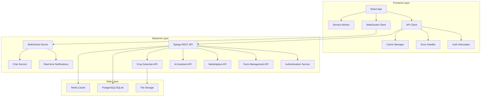

# API Frontend Integration Design Document

## Overview

This design document outlines the comprehensive API architecture and frontend integration strategy for the AgroBridge agricultural platform. The system will expand the existing Django REST framework backend with complete API coverage for all agricultural features and enhance the React frontend with robust API client integration, real-time capabilities, and offline support.

## Architecture

### High-Level Architecture



### API Architecture Patterns

- **RESTful Design**: Following REST principles with proper HTTP methods and status codes
- **JWT Authentication**: Stateless authentication with access and refresh tokens
- **Pagination**: Cursor-based pagination for large datasets
- **Filtering & Sorting**: Query parameter-based filtering and sorting
- **API Versioning**: URL-based versioning (e.g., `/api/v1/`)
- **Rate Limiting**: Role-based rate limiting to prevent abuse

## Components and Interfaces

### 1. Enhanced Authentication System

#### Backend Components

**Extended User Model**
```python
class User(AbstractUser):
    ROLE_CHOICES = [
        ('farmer', 'Farmer'),
        ('buyer', 'Buyer'),
        ('poultry_keeper', 'Poultry Keeper'),
        ('expert', 'Agricultural Expert'),
        ('ngo', 'NGO Representative'),
        ('admin', 'Administrator'),
    ]
    
    phone = models.CharField(max_length=20)
    role = models.CharField(max_length=20, choices=ROLE_CHOICES)
    is_verified = models.BooleanField(default=False)
    last_login_ip = models.GenericIPAddressField(null=True)
    failed_login_attempts = models.IntegerField(default=0)
    account_locked_until = models.DateTimeField(null=True)
```

**API Endpoints**
- `POST /api/v1/auth/register/` - User registration
- `POST /api/v1/auth/login/` - User login
- `POST /api/v1/auth/refresh/` - Token refresh
- `POST /api/v1/auth/logout/` - User logout
- `GET /api/v1/auth/me/` - Current user profile
- `POST /api/v1/auth/verify-email/` - Email verification
- `POST /api/v1/auth/reset-password/` - Password reset

#### Frontend Components

**Enhanced AuthContext**
```typescript
interface AuthContextType {
  user: User | null;
  login: (credentials: LoginCredentials) => Promise<void>;
  register: (userData: RegisterData) => Promise<void>;
  logout: () => Promise<void>;
  refreshToken: () => Promise<void>;
  isLoading: boolean;
  hasPermission: (permission: string) => boolean;
  updateProfile: (data: ProfileData) => Promise<void>;
}
```

### 2. Farm Management API

#### Backend Models
```python
class Farm(models.Model):
    owner = models.ForeignKey(User, on_delete=models.CASCADE)
    name = models.CharField(max_length=200)
    location = models.JSONField()  # Coordinates and address
    size_hectares = models.DecimalField(max_digits=10, decimal_places=2)
    farm_type = models.CharField(max_length=50)
    established_date = models.DateField()

class Crop(models.Model):
    farm = models.ForeignKey(Farm, on_delete=models.CASCADE)
    name = models.CharField(max_length=100)
    variety = models.CharField(max_length=100)
    planting_date = models.DateField()
    expected_harvest = models.DateField()
    area_hectares = models.DecimalField(max_digits=8, decimal_places=2)
    status = models.CharField(max_length=50)

class Livestock(models.Model):
    farm = models.ForeignKey(Farm, on_delete=models.CASCADE)
    animal_type = models.CharField(max_length=50)
    breed = models.CharField(max_length=100)
    count = models.IntegerField()
    health_status = models.CharField(max_length=50)
```

#### API Endpoints
- `GET/POST /api/v1/farms/` - List/Create farms
- `GET/PUT/DELETE /api/v1/farms/{id}/` - Farm details
- `GET/POST /api/v1/farms/{id}/crops/` - Farm crops
- `GET/POST /api/v1/farms/{id}/livestock/` - Farm livestock
- `GET /api/v1/farms/{id}/analytics/` - Farm analytics
- `POST /api/v1/farms/{id}/activities/` - Log farm activities

### 3. Marketplace API

#### Backend Models
```python
class Product(models.Model):
    seller = models.ForeignKey(User, on_delete=models.CASCADE)
    name = models.CharField(max_length=200)
    category = models.CharField(max_length=100)
    description = models.TextField()
    price_per_unit = models.DecimalField(max_digits=10, decimal_places=2)
    unit_type = models.CharField(max_length=50)
    quantity_available = models.IntegerField()
    location = models.JSONField()
    harvest_date = models.DateField()
    quality_grade = models.CharField(max_length=20)

class Order(models.Model):
    buyer = models.ForeignKey(User, on_delete=models.CASCADE)
    product = models.ForeignKey(Product, on_delete=models.CASCADE)
    quantity = models.IntegerField()
    total_price = models.DecimalField(max_digits=12, decimal_places=2)
    status = models.CharField(max_length=50)
    delivery_address = models.JSONField()
    order_date = models.DateTimeField(auto_now_add=True)
```

#### API Endpoints
- `GET/POST /api/v1/marketplace/products/` - List/Create products
- `GET /api/v1/marketplace/products/search/` - Search products
- `GET/PUT/DELETE /api/v1/marketplace/products/{id}/` - Product details
- `POST /api/v1/marketplace/orders/` - Create order
- `GET /api/v1/marketplace/orders/` - User orders
- `PUT /api/v1/marketplace/orders/{id}/status/` - Update order status

### 4. AI Assistant API

#### Backend Models
```python
class ChatConversation(models.Model):
    user = models.ForeignKey(User, on_delete=models.CASCADE)
    title = models.CharField(max_length=200)
    created_at = models.DateTimeField(auto_now_add=True)
    updated_at = models.DateTimeField(auto_now=True)

class ChatMessage(models.Model):
    conversation = models.ForeignKey(ChatConversation, on_delete=models.CASCADE)
    role = models.CharField(max_length=20)  # 'user' or 'assistant'
    content = models.TextField()
    metadata = models.JSONField(default=dict)
    timestamp = models.DateTimeField(auto_now_add=True)

class AIRecommendation(models.Model):
    user = models.ForeignKey(User, on_delete=models.CASCADE)
    recommendation_type = models.CharField(max_length=50)
    content = models.JSONField()
    confidence_score = models.FloatField()
    created_at = models.DateTimeField(auto_now_add=True)
```

#### API Endpoints
- `GET/POST /api/v1/ai/conversations/` - List/Create conversations
- `GET /api/v1/ai/conversations/{id}/messages/` - Conversation messages
- `POST /api/v1/ai/conversations/{id}/messages/` - Send message
- `POST /api/v1/ai/voice/transcribe/` - Voice to text
- `POST /api/v1/ai/voice/synthesize/` - Text to speech
- `GET /api/v1/ai/recommendations/` - Get AI recommendations

### 5. Crop Detection API

#### API Endpoints
- `POST /api/v1/crop-detection/analyze/` - Upload and analyze crop image
- `GET /api/v1/crop-detection/history/` - User's detection history
- `GET /api/v1/crop-detection/diseases/` - Disease database
- `GET /api/v1/crop-detection/treatments/{disease_id}/` - Treatment recommendations

### 6. Real-time Services

#### WebSocket Endpoints
- `/ws/notifications/{user_id}/` - Personal notifications
- `/ws/marketplace/` - Marketplace updates
- `/ws/chat/{conversation_id}/` - Chat messages
- `/ws/farm-monitoring/{farm_id}/` - Farm sensor data

#### Frontend WebSocket Client
```typescript
class WebSocketClient {
  private connections: Map<string, WebSocket> = new Map();
  
  connect(endpoint: string, token: string): Promise<WebSocket>;
  disconnect(endpoint: string): void;
  send(endpoint: string, data: any): void;
  onMessage(endpoint: string, callback: (data: any) => void): void;
}
```

## Data Models

### Frontend TypeScript Interfaces

```typescript
interface User {
  id: string;
  username: string;
  email: string;
  role: UserRole;
  profile: UserProfile;
  permissions: string[];
}

interface Farm {
  id: string;
  name: string;
  location: Location;
  size_hectares: number;
  crops: Crop[];
  livestock: Livestock[];
  analytics: FarmAnalytics;
}

interface Product {
  id: string;
  name: string;
  category: string;
  price_per_unit: number;
  quantity_available: number;
  seller: User;
  images: string[];
  location: Location;
}

interface ChatMessage {
  id: string;
  role: 'user' | 'assistant';
  content: string;
  timestamp: Date;
  metadata?: Record<string, any>;
}
```

## Error Handling

### Backend Error Response Format
```json
{
  "error": {
    "code": "VALIDATION_ERROR",
    "message": "Invalid input data",
    "details": {
      "field_errors": {
        "email": ["This field is required"]
      }
    },
    "timestamp": "2024-01-01T12:00:00Z"
  }
}
```

### Frontend Error Handling Strategy
- **Global Error Boundary**: Catch and display unexpected errors
- **API Error Interceptor**: Handle common HTTP errors (401, 403, 500)
- **Retry Logic**: Automatic retry for network failures
- **User-Friendly Messages**: Convert technical errors to user-friendly messages
- **Error Logging**: Send error reports to monitoring service

## Testing Strategy

### Backend Testing
- **Unit Tests**: Test individual API endpoints and business logic
- **Integration Tests**: Test API endpoints with database interactions
- **Authentication Tests**: Test JWT token handling and permissions
- **Performance Tests**: Load testing for high-traffic endpoints

### Frontend Testing
- **Component Tests**: Test React components with API mocking
- **Integration Tests**: Test API client with mock server
- **E2E Tests**: Test complete user workflows
- **WebSocket Tests**: Test real-time functionality

### API Testing Tools
- **Postman Collections**: Comprehensive API endpoint testing
- **Swagger/OpenAPI**: Interactive API documentation and testing
- **Jest/Pytest**: Unit and integration test frameworks

## Performance Optimization

### Backend Optimizations
- **Database Indexing**: Optimize queries with proper indexes
- **Query Optimization**: Use select_related and prefetch_related
- **Caching**: Redis caching for frequently accessed data
- **Pagination**: Implement cursor-based pagination
- **Background Tasks**: Use Celery for heavy operations

### Frontend Optimizations
- **React Query**: Intelligent caching and synchronization
- **Code Splitting**: Lazy load components and routes
- **Image Optimization**: Compress and lazy load images
- **Service Worker**: Cache API responses for offline access
- **Bundle Optimization**: Tree shaking and minification

## Security Considerations

### Authentication & Authorization
- **JWT Security**: Short-lived access tokens with refresh tokens
- **Role-Based Access Control**: Granular permissions system
- **Rate Limiting**: Prevent API abuse and brute force attacks
- **Input Validation**: Comprehensive input sanitization
- **CORS Configuration**: Proper cross-origin resource sharing

### Data Protection
- **HTTPS Only**: All API communication over HTTPS
- **Data Encryption**: Encrypt sensitive data at rest
- **File Upload Security**: Validate and scan uploaded files
- **SQL Injection Prevention**: Use parameterized queries
- **XSS Protection**: Sanitize user-generated content

## Deployment and Monitoring

### API Monitoring
- **Health Checks**: Endpoint monitoring and alerting
- **Performance Metrics**: Response time and throughput tracking
- **Error Tracking**: Centralized error logging and alerting
- **Usage Analytics**: API usage patterns and optimization insights

### Frontend Monitoring
- **Error Tracking**: JavaScript error monitoring
- **Performance Monitoring**: Core Web Vitals tracking
- **User Analytics**: User behavior and feature usage
- **Real User Monitoring**: Actual user experience metrics